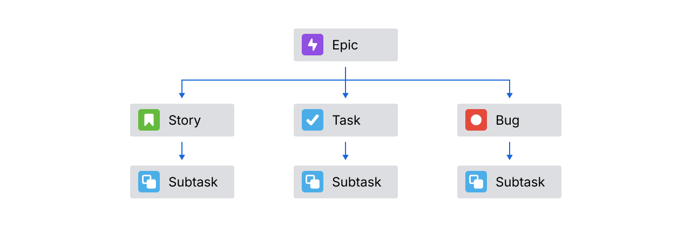
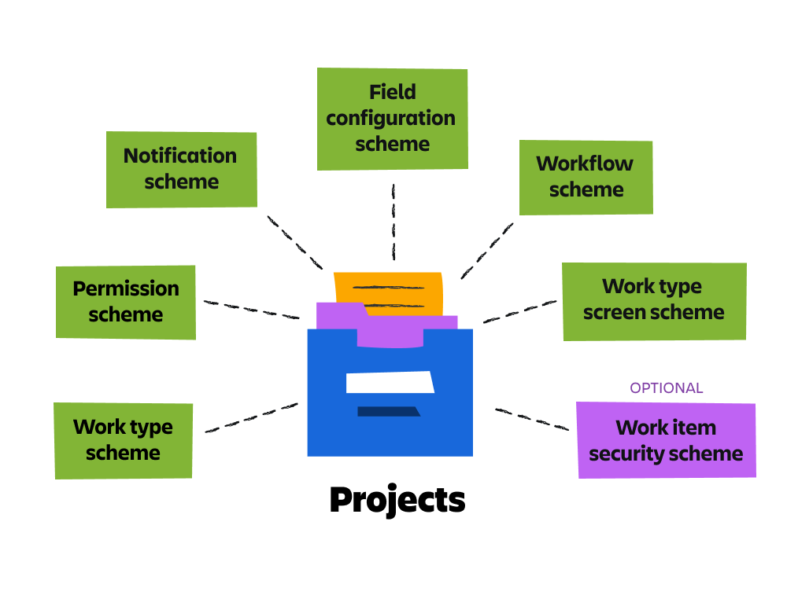
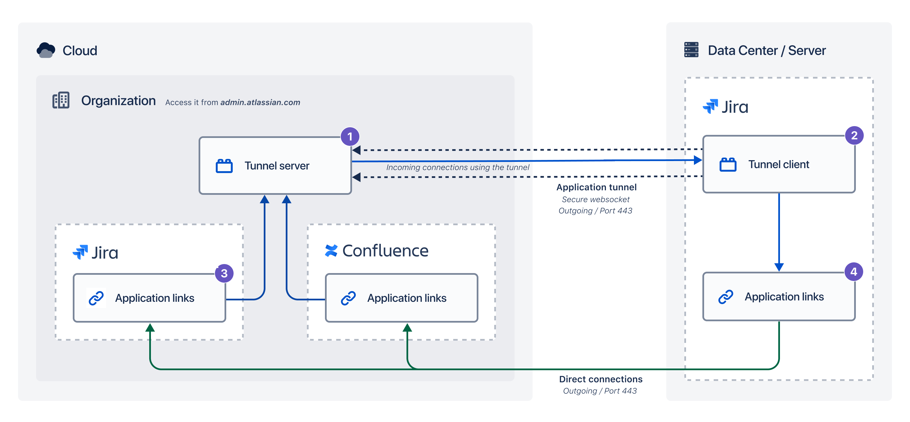

# Jira

## Get started quickly with Jira
- Atlassian product
- Jira is project management software more like a TODO list for team Members

- A `Work item` is the fundamental building block of any Jira Project

- A `project` is a collection of related work items. In Jira, every work item belongs to a project.
    - `Project keys`are short versions of the project name that identify the work items in that project. 

- A `board` is a visualization of the work in a project.
    - The work moves through three statuses, ***To Do, In Progress, and Done***. 
    - Types of boards in Jira:
        - `Kanban boards` support a continuous flow of work.
        - `Scrum boards` track groups of work items that the team completes during a fixed period of time

| Feature         | **Kanban Board**| **Scrum Board**  |
| --------------- | --------------- | ---------------- |
| **Work Flow**   | Continuous – work items move in and out anytime | Time-boxed – work happens in fixed-length sprints    |
| **Focus**       | Continuous delivery and flow efficiency         | Delivering a set amount of work per sprint           |
| **Planning**    | Ongoing, as needed                              | Planned at the start of each sprint                  |
| **When to Use** | When priorities change frequently               | When you work in structured, sprint-based iterations |

---

- Work Types
    - `Epic` **(Parent *work items*)** : An epic represents a large body of work that can break down into smaller chunks.
    - `Story` : a deliverable from the user's perspective, non-technical description of work item
    - `Task` : a detailed description of a work item
    - `Bug` : a problem or error. 
    - `SubTask`: the smallest piece of work

- Work Item fields:
    - Work item key (unique identifier auto gen): project key + sequential number
    - Summary & Description
    - Labels
    - Due Date
    - Assignee and Reporter: 
        - The **assignee** is the person assigned to work on the work item. The **reporter** is the person who created the work item. 
        - **Only one user** can be in each field; you can’t have multiple assignees or reporters for a single work item.
        
## Track your work effectively in Jira

- **Add attachments** to work items like png, link, etc..
- View work item **history**
- **Link** work items
- relationship between work items
    - Relates to
    - Depends on / is depended on by
    - Blocks / is blocked by
    - Clones / is cloned by
- Move work items
    - Change Work Item Type
    - Move SubTask to other parents
    - Move work to other project
- `List View`: edit items in place  
    - Also used for bulk actions

### Search to find information in Jira
- Types
    - Search Bar
    - Basic 
    - Advanced
- You can only use basic search to find work items, not projects or boards. If you want to find a project or board, the search bar can help

- Basic
    - Go to basic search
    - Enter a keyword
    - Set criteria
    - Sort your results
- Advanced JQL

### Schedule work with the Timeline and Calendar views in Jira
- provide two views
    - Timeline view (Manage Dependency)
    - Calendar view

## Personalize how you work in Jira

- A `dashboard `is a customized screen to give you a high-level snapshot of everything happening in Jira.
- Dashboards are made up of small, configurable blocks called `gadgets`.

- We can use shortcuts & Commands to navigate and edit work items 

## Jira Admin

### Roles:
- organization admin (Manage sites)
    - only individuals who can manage users, groups, and product access
    - An org admin performs their tasks within the Atlassian Admin Hub 
- Product admin == Jira admin   
    - Configure product settings
    - Create Project & Project Roles
    - Assign global permissions
- Project admin  (Depend on the type of the project)
    - company-managed: adding users and groups to project roles. These work with the project permission scheme
    -  team-managed: Create their own custom roles & adding users and groups to project roles & manage their own custom fields
- site administrator 
    - Manage billing & Manage products and app.

### Best Practice

- Best Practice:
    - Persist Project Key
    - Reuse other configurations: Use Schema 
    - Test in a sandbox
    - Create role-specific dashboards 
- Steps to implement Jira:
    - Discover and understand business requirements.
    - Map requirements to Jira configurations.
    - Implement in Jira.

### Project  
- `Project type`: (who can configure your project and if those configurations are shared)
    - ***Team-managed*** projects (Flexible & Less Restrictive )
    - ***Company-managed*** projects (Use Schema )

- `Project Template`: ( provides pre-configurations for your project, like work types and workflows.)
- four commonly Software project templates: 
    - kanban (work-in-progress limits)
    - scrum (work in sprints)
    - bug tracking ( reported bugs, suggested improvements)
    - top-level planning. (helps team or organization leads visualize and track large initiatives)

- `Schemes`:
    - collections of configurations can be reusable 
    - Six schemes are always included in company-managed projects:
        - Work type scheme
        - Permission scheme
        - Notification scheme
        - Field configuration scheme
        - Workflow scheme
        - Work type screen scheme
        

- `Project roles and permissions`:
    - Permissions add a layer of security
    - Control the content that users can access and the actions they can perform.

- `Global permissions` control system-wide functionality across all of Jira and Jira Service Management.
    - Jira system administrators
    - Jira administrators
    - Jira users
    - Browse users
    - Make bulk changes

- `Project permissions` control functionality in a project for users, groups, or project roles.
    - Company-managed project permissions (permission schemes)
        - Standalone permissions (control a single piece of functionality)
        - Interrelated permissions (will not have any effect unless combined with other permissions)
        - Permissions that need to meet global prerequisites in order to have an effect

- Configure internal project access
    - Permissions are different from internal project access. Internal project access determines how users outside of your project can interact with your project. 
    - Types:
        - Private (no external access or view )
        - Limited (no External access but view)
        - Open (External access & View)

NOTE: 
In order to make your permissions and roles really effective you have to set the Internal project access to one of two private or Omited

# APC
- Access, permissions, and security: 25%-30%
- General project configuration: 10%-15%
- Issue types, fields, and screens: 15%-20%
- Workflows and automation: 15%-20%
- Notifications: 5%-10%
- Advanced user features: 10%-15%
- System administration: 5%-10%

## Intro
- **Atlassian organization** is top level that **contain sites**
- each **site** represent a city associated with a **domain**
- Each site can have licenses for one or more **Atlassian product**. 

## Implement Jira
- three steps:
    - Discover and understand **business requirements**.
    - **Map** requirements to Jira configurations.
    - **Implement** in Jira.

### Roles:
- organization admin (Manage sites)
    - **only** individuals who can manage users, groups, and product access
    - An org admin performs their tasks within the **Atlassian Admin Hub** 
- Product admin == `Jira admin`   
    - Configure product settings
    - Create Project & Project Roles
    - Assign global permissions
- Project admin  (Depend on the type of the project)
    - **company-managed**: adding users and groups to project roles. These work with the project permission scheme
    -  **team-managed**: Create their own custom roles & adding users and groups to project roles & manage their own custom fields
- site administrator 
    - Manage billing & Manage products and app.

## Project in Jira
- `Project type`: (who can configure your project and if those configurations are shared)
    - ***Team-managed*** projects (Flexible & Less Restrictive )
    - ***Company-managed*** projects (Use Schema )

- `Project Template`: ( provides pre-configurations for your project, like work types and workflows.)
- four commonly Software project templates: 
    - kanban (work-in-progress limits)
    - scrum (work in sprints)
    - bug tracking ( reported bugs, suggested improvements)
    - top-level planning. (helps team or organization leads visualize and track large initiatives)

- `Schemes`:
    - collections of configurations can be reusable 
    - Six schemes are always included in company-managed projects:
        - Work type scheme
        - Permission scheme
        - Notification scheme
        - Field configuration scheme
        - Workflow scheme
        - Work type screen scheme

- Only Jira admins can create and modify schemes and associate them with projects.

# Advanced Topics

## Connect to Data Center instances with application tunnels

- we can use app linking to link apps to each other, we need to create application tunnels
- `Application tunnels` provide a secure pathway between your Atlassian cloud organization and Data Center instances that live in your network. 
    - Tunnel server: You access it from admin.atlassian.com where you create a tunnel.
    - Tunnel client: Installed as a Marketplace app in your Data Center instance.
    - Application link (cloud): You create a tunneled application link in each of your Atlassian cloud apps and point it at an existing tunnel. You can link multiple cloud apps to a single tunnel. The application link must always be created on the cloud side.
    - Application link (self-managed): The reciprocal link will be automatically created in your Data Center instance. Only incoming connections to your network use the tunnel, the outgoing ones will reach your Atlassian cloud apps directly.

## Audit
- we can audit from:
    - (Jira -> System -> Audit Logs)
    - (ِAdmin -> Security -> Audit Logs)

## Restore & system backup
- We create a backup and download it (option to include media)
- We then can restore by  import it in jira
- Only Org admin can import backup files.
- We can Import work using ` External System Import `   
    - You can import data from a CSV, JSON, or Trello file

## Permissions
- Permissions are controlled at the organization, product, project, and work item levels.

- `Global permissions` control system-wide functionality across all of Jira and Jira Service Management.
    - Jira system administrators
    - Jira administrators
    - Jira users
    - Browse users
    - Make bulk changes
- Only Jira admins can modify global permissions.

- `Project permissions` control functionality in a project for users, groups, or project roles.
    - Jira admins manage project permissions for ***company-managed projects*** through permission schemes.
        - categorized :
            - Standalone permissions (control a single piece of functionality)
            - Interrelated permissions (will not have any effect unless combined with other permissions)
            - Permissions that need to meet global prerequisites in order to have an effect
    - Project admins manage project permissions for ***team-managed projects*** through custom roles. 

- Configure internal project access
    - Permissions are different from internal project access. Internal project access determines how users outside of your project can interact with your project. 
    - Types:
        - Private (no external access or view )
        - Limited (no External access but view)
        - Open (External access & View)

### Configure global permissions in Jira

global permissions can be add only to groups
### Notes on Permissions
- Avoid using Public with most global permissions. Instead, use project permissions to control the access of anonymous users.
- The Jira Permission Helper can help you understand a user's permissions. You can check a specific permission for a specific user, and even specify a work item key.

# Secondary Topics
## Customize Jira Experience
- Change Default Dashboard
- Change App Logo & Name 
- Change User Default preference
- Change Color & fell

## Some important settings 
- Configure attachment settings
    - limit the attachment size and enable ZIP support
- Configure work linking
    - enable the feature
- Create application links
- Time tracking in Jira
- Audit Track
    - audit log tracks key activities and configuration changes not everything
    - actions that impact users and projects
    - doesn’t track work item updates or pages

TODO:
    create role and assign permission in Company Managed Project