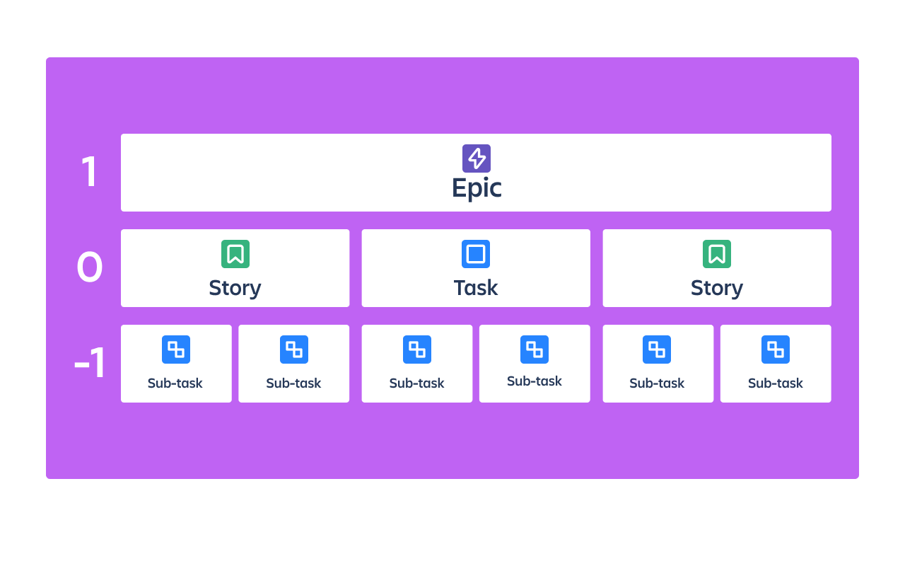
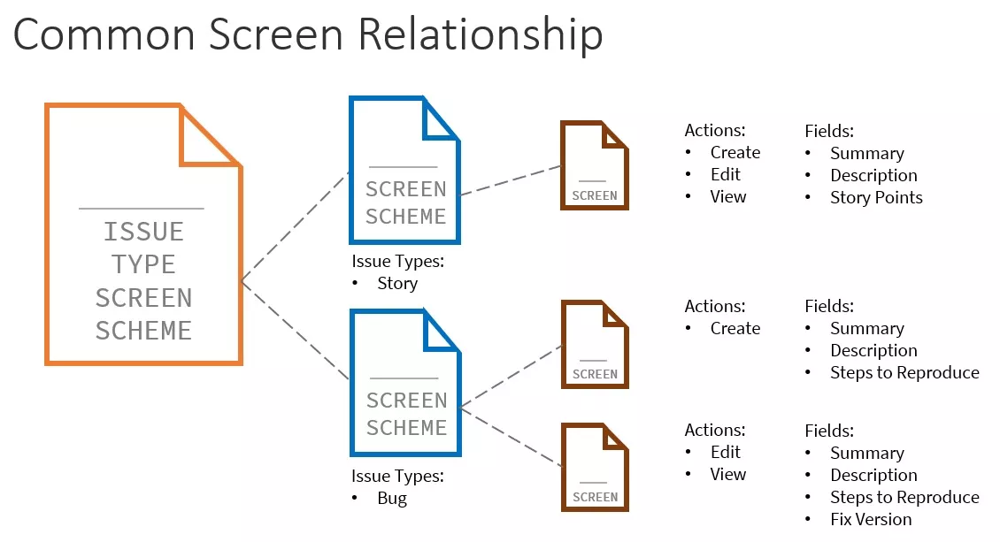
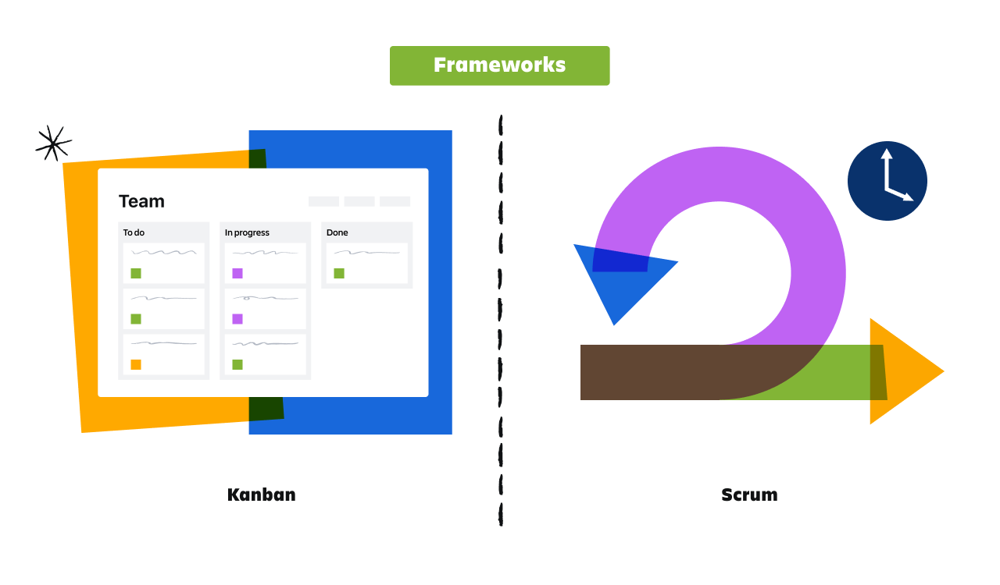
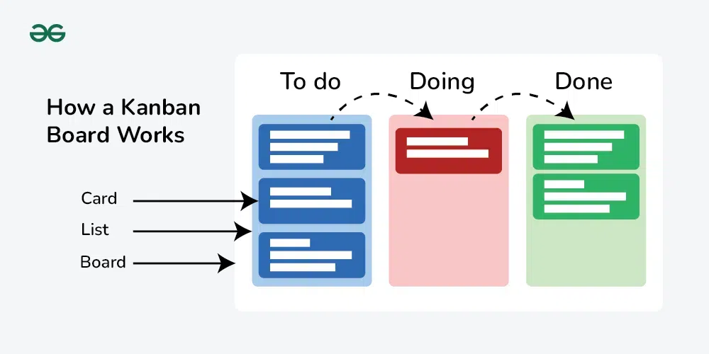
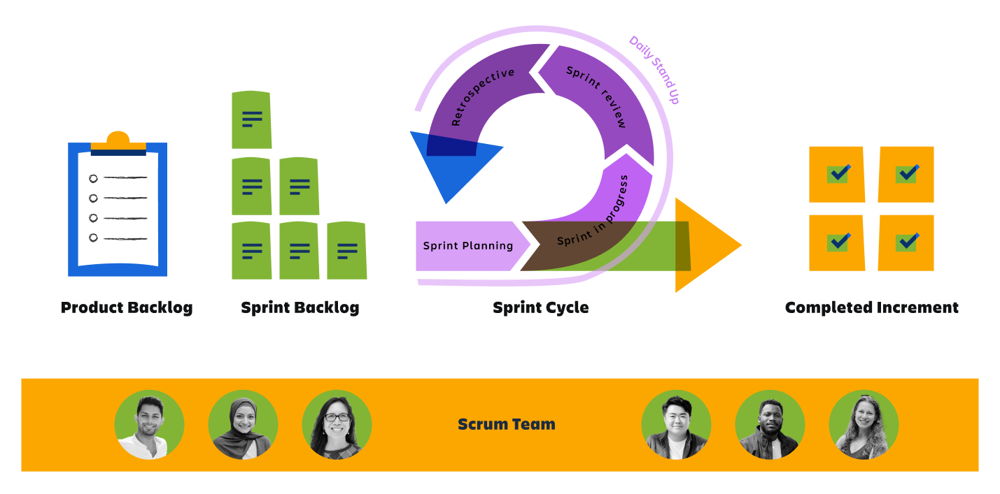
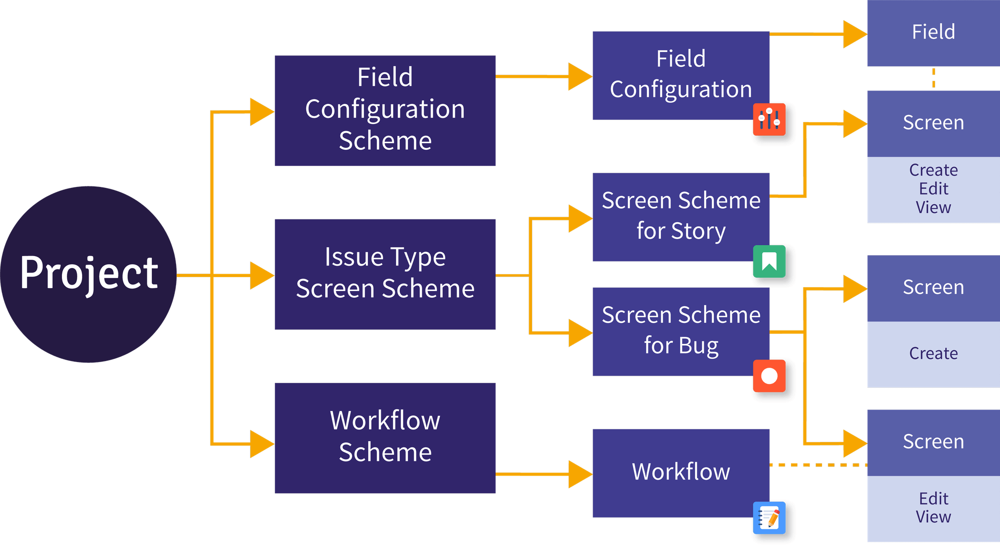

# Jira

## Get started quickly with Jira
- Atlassian product
- Jira is project management software more like a TODO list for team Members

- A `Work item` is the fundamental building block of any Jira Project

- A `project` is a collection of related work items. In Jira, every work item belongs to a project.
    - `Project keys`are short versions of the project name that identify the work items in that project. 

- A `board` is a visualization of the work in a project.
    - The work moves through three statuses, ***To Do, In Progress, and Done***. 
    - Types of boards in Jira:
        - `Kanban boards` support a continuous flow of work.
        - `Scrum boards` track groups of work items that the team completes during a fixed period of time

| Feature         | **Kanban Board**| **Scrum Board**  |
| --------------- | --------------- | ---------------- |
| **Work Flow**   | Continuous – work items move in and out anytime | Time-boxed – work happens in fixed-length sprints    |
| **Focus**       | Continuous delivery and flow efficiency         | Delivering a set amount of work per sprint           |
| **Planning**    | Ongoing, as needed                              | Planned at the start of each sprint                  |
| **When to Use** | When priorities change frequently               | When you work in structured, sprint-based iterations |

---

- Work Types
    - `Epic` **(Parent *work items*)** : An epic represents a large body of work that can break down into smaller chunks.
    - `Story` : a deliverable from the user's perspective, non-technical description of work item
    - `Task` : a detailed description of a work item
    - `Bug` : a problem or error. 
    - `SubTask`: the smallest piece of work

- Work Item fields:
    - Work item key (unique identifier auto gen): project key + sequential number
    - Summary & Description
    - Labels
    - Due Date
    - Assignee and Reporter: 
        - The **assignee** is the person assigned to work on the work item. The **reporter** is the person who created the work item. 
        - **Only one user** can be in each field; you can’t have multiple assignees or reporters for a single work item.
        
## Track your work effectively in Jira

- **Add attachments** to work items like png, link, etc..
- View work item **history**
- **Link** work items
- relationship between work items
    - Relates to
    - Depends on / is depended on by
    - Blocks / is blocked by
    - Clones / is cloned by
- Move work items
    - Change Work Item Type
    - Move SubTask to other parents
    - Move work to other project
- `List View`: edit items in place  
    - Also used for bulk actions

### Schedule work with the Timeline and Calendar views in Jira
- provide two views
    - Timeline view (Manage Dependency)
    - Calendar view

## Personalize how you work in Jira

- A `dashboard `is a customized screen to give you a high-level snapshot of everything happening in Jira.
- Dashboards are made up of small, configurable blocks called `gadgets`.

- We can use shortcuts & Commands to navigate and edit work items 

## Jira Admin

### Roles:
- organization admin (Manage sites)
    - only individuals who can manage users, groups, and product access
    - An org admin performs their tasks within the Atlassian Admin Hub 
- Product admin == Jira admin   
    - Configure product settings
    - Create Project & Project Roles
    - Assign global permissions
- Project admin  (Depend on the type of the project)
    - company-managed: adding users and groups to project roles. These work with the project permission scheme
    -  team-managed: Create their own custom roles & adding users and groups to project roles & manage their own custom fields
- site administrator 
    - Manage billing & Manage products and app.

### Best Practice

- Best Practice:
    - Persist Project Key
    - Reuse other configurations: Use Schema 
    - Test in a sandbox
    - Create role-specific dashboards 
- Steps to implement Jira:
    - Discover and understand business requirements.
    - Map requirements to Jira configurations.
    - Implement in Jira.

### Project  
- `Project type`: (who can configure your project and if those configurations are shared)
    - ***Team-managed*** projects (Flexible & Less Restrictive )
    - ***Company-managed*** projects (Use Schema )

- `Project Template`: ( provides pre-configurations for your project, like work types and workflows.)
- four commonly Software project templates: 
    - kanban (work-in-progress limits)
    - scrum (work in sprints)
    - bug tracking ( reported bugs, suggested improvements)
    - top-level planning. (helps team or organization leads visualize and track large initiatives)

- `Schemes`:
    - collections of configurations can be reusable 
    - Six schemes are always included in company-managed projects:
        - Work type scheme
        - Permission scheme
        - Notification scheme
        - Field configuration scheme
        - Workflow scheme
        - Work type screen scheme
        

- `Project roles and permissions`:
    - Permissions add a layer of security
    - Control the content that users can access and the actions they can perform.

- `Global permissions` control system-wide functionality across all of Jira and Jira Service Management.
    - Jira system administrators
    - Jira administrators
    - Jira users
    - Browse users
    - Make bulk changes

- `Project permissions` control functionality in a project for users, groups, or project roles.
    - Company-managed project permissions (permission schemes)
        - Standalone permissions (control a single piece of functionality)
        - Interrelated permissions (will not have any effect unless combined with other permissions)
        - Permissions that need to meet global prerequisites in order to have an effect

- Configure internal project access
    - Permissions are different from internal project access. Internal project access determines how users outside of your project can interact with your project. 
    - Types:
        - Private (no external access or view )
        - Limited (no External access but view)
        - Open (External access & View)

NOTE: 
In order to make your permissions and roles really effective you have to set the Internal project access to one of two private or Omited

# Other Topics

## Connect to Data Center instances with application tunnels

- we can use app linking to link apps to each other, we need to create application tunnels
- `Application tunnels` provide a secure pathway between your Atlassian cloud organization and Data Center instances that live in your network. 
    - Tunnel server: You access it from admin.atlassian.com where you create a tunnel.
    - Tunnel client: Installed as a Marketplace app in your Data Center instance.
    - Application link (cloud): You create a tunneled application link in each of your Atlassian cloud apps and point it at an existing tunnel. You can link multiple cloud apps to a single tunnel. The application link must always be created on the cloud side.
    - Application link (self-managed): The reciprocal link will be automatically created in your Data Center instance. Only incoming connections to your network use the tunnel, the outgoing ones will reach your Atlassian cloud apps directly.

## Audit
- we can audit from:
    - (Jira -> System -> Audit Logs)
    - (ِAdmin -> Security -> Audit Logs)

## Restore & system backup
- We create a backup and download it (option to include media)
- We then can restore by  import it in jira
- Only Org admin can import backup files.
- We can Import work using ` External System Import `   
    - You can import data from a CSV, JSON, or Trello file

## Customize Jira Experience
- Change Default Dashboard
- Change App Logo & Name 
- Change User Default preference
- Change Color & fell

## Some important settings 
- Configure attachment settings
    - limit the attachment size and enable ZIP support
- Configure work linking
    - enable the feature
- Create application links
- Time tracking in Jira
- Audit Track
    - audit log tracks key activities and configuration changes not everything
    - actions that impact users and projects
    - doesn’t track work item updates or pages

# APC 120
- Access, permissions, and security: 25%-30%
- Issue types, fields, and screens: 15%-20%
- Workflows and automation: 15%-20%
- Advanced user features: 10%-15%
- Notifications: 5%-10%
- General project configuration: 10%-15%
- System administration: 5%-10%

## Intro
- **Atlassian organization** is top level that **contain sites**
- each **site** represent a city associated with a **domain**
- Each site can have licenses for one or more **Atlassian product**. 

## Implement Jira
- three steps:
    - Discover and understand **business requirements**.
    - **Map** requirements to Jira configurations.
    - **Implement** in Jira.

### Roles:
- organization admin (Manage sites)
    - **only** individuals who can manage users, groups, and product access
    - An org admin performs their tasks within the **Atlassian Admin Hub** 
- Product admin == `Jira admin`   
    - Configure product settings
    - Create Project & Project Roles
    - Assign global permissions
- Project admin  (Depend on the type of the project)
    - **company-managed**: adding users and groups to project roles. These work with the project permission scheme
    -  **team-managed**: Create their own custom roles & adding users and groups to project roles & manage their own custom fields
- site administrator 
    - Manage billing & Manage products and app.

## Project in Jira
- `Project type`: (who can configure your project and if those configurations are shared)
    - ***Team-managed*** projects (Flexible & Less Restrictive )
    - ***Company-managed*** projects (Use Schema )

- `Project Template`: ( provides pre-configurations for your project, like work types and workflows.)
- four commonly Software project templates: 
    - kanban (work-in-progress limits)
    - scrum (work in sprints)
    - bug tracking ( reported bugs, suggested improvements)
    - top-level planning. (helps team or organization leads visualize and track large initiatives)

- `Schemes`:
    - collections of configurations can be reusable 
    - Six schemes are always included in company-managed projects:
        - Work type scheme
        - Permission scheme
        - Notification scheme
        - Field configuration scheme
        - Workflow scheme
        - Work type screen scheme

- Only Jira admins can create and modify schemes and associate them with projects.

# ***`Access & Permissions & Security` 28%***
- There are 3 Levels of permissions in Jira
    - Product 
    - Project/Space 
    - Work Item (Issue)

## 0. Organization Level
- Manage Organizations at whole
- Manage User/Groups
- Manage Product access 

- There are three options for the organization admin to assign to a user 
    - User  (Normal User for App)
    - User access Admin (User but for Org Admin Atlassian)
    - Administrator (Admin for App)
    - site admin (Manage site users & )

## 1. Product Level 
- Jira admins Manage Global permissions
- Manage the instance permissions 

### Global Permissions
- `Global permissions` control system-wide functionality across all of Jira and Jira Service Management.
    - Administer Jira
    - Browse users and groups
    - Share dashboards and filters
    - Manage group filter subscriptions
    - Make bulk changes
    - Create team-managed projects

- Only Jira admins can modify global permissions.

#### Steps
- Navigate to (Settings -> Global Permissions)
- Edit permissions or Grant a permission to a Group

## 2. Project/Space Level
- Manage user access to project 
- Project-level functionality
- Project permissions are managed in two ways:
    - `Project admins` manage project permissions for ***team-managed projects*** through *custom roles*.
    - `Jira admins` manage project permissions for ***company-managed projects*** through *permission schemes*. 

### Team managed Project
- ***`NOTES on Team Managed Project Access & Permissions`***
- `Team-Managed project` is based on ***roles and access levels***
- Internal project access sets the visibility boundary of the project.
- Inside that boundary, roles (Administrator / Member / Viewer) define what each person can do.

#### Steps
> - ***Find Here:*** Project Settings -> Access
- We will have default three roles 
    - Administrator (Read, Write & Delete)
    - Member (Read & Write)
    - Viewer (Read)
- We can manage roles (Create, Delete, Modify)
- We can add people to this project and assign roles to them 
- First we need to define Internal Project access Mode:
    - Private (no external access or view )
    - Limited (no External access but view)
    - Open (External access & View)
- This mode give the user roles the actual effect.

### Company Manged Project
- ***`NOTES on Company Managed Project Access & Permissions`***
- Group/User assigned to a Project Role
- Project Role is grated certain permission according to permission scheme
- Project Use the custom permission scheme
- permission scheme contain:
    - Permissions 
    - Granted to (Group, Project Role, User, any Logged in)
- Jira admins manage project permissions for ***company-managed projects*** through permission schemes.
    - categorized :
        - Standalone permissions (control a single piece of functionality)
        - Interrelated permissions (will not have any effect unless combined with other permissions)
        - Permissions that need to meet global prerequisites in order to have an effect

#### Steps
- We need org admin to create users and groups
- For reusability and scalability we use **groups** 
- Step One: Create Groups (departments)
- Step Two: Create Project Roles (Admin, Dev, User)
- Step Three: Create Permission Scheme (By grant permission to Group/User/`Role`)
- Step Four: Change the Project Permission scheme to the created one
- Step Five: add People (Users/Groups) and assign to them Project Roles

## 3. Work item security permissions
### Team Managed Projects
- `Work restrictions` control which project roles can view newly created work items of that type

### Company Managed Projects
- `Work item-level` security specifies which users, groups, and project roles can see work
- We use this security level when we need to make some work items closed from some users or to some users
- it more like restricting view and access on the level of work items.

- It use `Work item security schemes` & `Security Level`
- Work item security scheme contain security levels which define who can view a work item

- Subtasks inherit their parent work item’s security level.
- Use Cases:
    - Only the user in a specific field (like Reporter) to be able see that work item.
    - Only a defined list of people to see certain work items.
    - Only certain users to see work items so other project members don’t see clutter.
    - Only certain users to see newly created work.

- Steps:
    - Create Work item security scheme
    - Create Security levels inside of the scheme
    - Assign user/groups/roles to each level
    - Add the Security Level field to work items
    - We then make our project use this work item security scheme `forgettable`

#### Troubleshoot Work Item security
- We Consider:
    - Work item scheme & its security level
    - which group/user/role assigned to which level
    - the visibility of issue security level field
    - the permission in permissions scheme grated to user/role/group (view issue/edit issue & issue security)
    - 
- Note on the `visibility` of Work item security scheme
    - Ensure the project’s screen schemes include the Security Level field for the necessary work types in the right place.
    - Ensure the project’s field configuration schemes show the Security Level field for the necessary screens and apply to the necessary work types.
    - Ensure the project’s layout for work items doesn’t hide the Security Level field when it’s empty.

## Notes on Permissions
- Avoid using Public with most global permissions. Instead, use project permissions to control the access of anonymous users.
- The Jira `Permission Helper` can help you understand a user's permissions. You can check a specific permission for a specific user, and even specify a work item key.

- Permissions is additive

- Project Role VS Groups
    - Solving a problem of choosing which to use project role or Groups to give certain permission
    - Project Roles are project based VS Groups are for the whole instance.
    - If Users need a permission by default in all projects attached to that permission scheme, then I would use groups
    - If the users/groups differ per project, then use project roles.
    - note that you can also add groups to a project role.

# ***`Workflows and Automation` 14%***

## Workflows
- In every project we have work items that go through status from to do to complete.
- The path that your work items take is called a `workflow`.
- Each Jira workflow components
    - ***Statuses***: represents the state of a work item at a particular point in the workflow
    - ***Transitions***: represents the state of a work item at a particular point in the workflow
        - one-way Transitions 
        - Global transitions: move a work item from any status to that status vice versa
    - ***Resolution***: provides more detail when users close a work item. (why this item closed)
        - The Resolution field is only available in company-managed projects.
- There are default workflows based on the project 
- There is `simplified workflow` (scrum/kanban) 
    - uses global transitions 
    - no transition screens, and has no conditions applied to its transitions
- `Custom workflows` used for complex requirements
    - use transitions, conditions, user input validation, or automated functions

### Complex Workflow 
#### Triggers
- `Triggers` automatically transition work when certain events occur in your ***development tools***
- `Notes`: When a transition triggers automatically, it ignores any transition rules, or permissions configured on 
the transition. However, they still apply when a user manually transitions the work item.

#### Rules
- Restrict transition (conditions):
    - Criteria that the workflow must meet before it can transition a work item.
    - If a user does not meet the condition, they won’t even see the button on the issue screen.

- Validate details
    - Check that any input given during the transition is valid before it transitions the work item.
    - Check that required conditions are true after the user clicks the transition, but before it executes.

- Perform action
    - perform actions after a transition executes

#### Properties
- are key-value pairs that can be used to further customize transitions.
- Use properties to configure more detailed behaviors for your workflows.
- Workflows commonly use properties to further restrict permissions beyond a company-managed project’s permission scheme.
- Ex: make work item not editable in some state 

### Configure company-managed workflows

- `Workflow scheme`:
    - act as container of work item types workflows
    - ex: workflow for tasks/epics, another workflow for story
- `Workflow` (where you define the workflow and rules)

- `STEPS`:
    - Create Workflow Scheme 
    - Create workflow 
    - In workflow create:
        - Status 
        - Transitions (flow between status)
        - Restrict, Validate, Perform action for Transition rules
        - Use Triggers/ Properties in status 
        - Publish the workflow
        - Use it in Project
        - assign it to work type 

- Best practice:
    - use a transition rule to set resolutions automatically
    - > Never rename a statues like `To Do` will change to all Jire product

### Configure team-managed workflows
- Team-managed projects support most of the same workflow configurations as company-managed projects. But, you can’t:
    - Use the same workflow for multiple work types
    - Use transition screens
    - Use resolutions

- Steps:
    - Space Settings -> Work Type -> chose any work type -> edit workflow

## Automation

- There are two types of rules:
    - Global rule -> across spaces
    - Project rule -> for project only

- There are several ways to create automation rules:
    - Select a template that meets your needs. `(automation template library)`
    - Use natural language to have AI create automations for you.
    - Use the rule builder to manually build custom automation rules from scratch.
- Automation rules are essentially if-then statements.

### rule details
- Every rule has its important details:
    - Name/description
    - Scope 
    - Owner/ Actor
    - Allow rule trigger checkbox -> Enable trigger this rule as an action at the end of another rule.

### building blocks of automation
#### Triggers (required)
- This tells jira to do the automation rule
- Every rule can has only one trigger
- Triggers can be set to run on a schedule, or manual or for event in jira 
- For multiple trigger, we can use ***Multiple work item events*** trigger
    - automate the same rule for multiple events/triggers
- For a specific Trigger that we want to use but for only certain filtered event.
- A trigger-level condition is a filter built directly into the trigger itself, instead of being a separate “Condition” block later in your rule.

#### Conditions (optional)
- We need to check for a certain criteria, that must be met for your rule to continue running.
- Common:
    - Work item fields condition
    - JQL condition
    - User condition
    - Related work items condition

#### Branches (optional)
- Branching means creating a side path in your rule.
- a section that does actions on other related issues, not just the one that triggered the rule.
- Branching is like looping through the related issues  that are connected to the main trigger issue.
- when use a brach the main flow go as it, so 2 flows run simultaneously
- Two Main Types: 
    - Related Work Items (for related work items)
    - Advanced branching ( enter a smart value, and perform actions on that value as an object)
    - Branch at the same time ( more than one branch)

- Ex: update all subtasks for the task that triggered the automation rule

#### Advanced components (optional)
- Advanced components are reusable rule pieces — like small automation blocks you can use in many rules.
    - Delay until
    - Loop
    - Branch at the same time ( multiple groups of automation rule components to execute simultaneously)

#### Actions (required)
- The actual action performed if the rule is triggered and complete to the action.

### Smart values

- Are essentially variables, acting as placeholders for dynamic data in conditions and actions. 
- They allow you to access and manipulate data without using hard-coded values
- ex: {{now}}, {{user.emailAddress}}

### Best practice
- Use log action
- Validate your rules using the "notify on error" setting

### Tasks
- Clean up task
- close an epic when all stories have been completed.
- remind a user of the uncommented tasked assgined to him
- test if else

- Perform action to all sub tasks of epic using Branch

# ***`Notifications` 8%***

## Notifications for company-managed projects using schemes
- `Notification scheme`:
    - associate events with specific email recipients.
    - it uses system events & Custom events
- The scheme has event (system event) and Recipients (role/user/group)
- The Workflow has event fired when item created or moved in transitions
- This event is associated with the notification scheme and assigned to a recipient 
- Make sure that user Personal settings notification is correct 

### Notes
- Users can configure some of their own notifications through their Jira settings. Their preferences override notification schemes.
- make sure to only send notifications for events that users truly need to know about as they happen. 
- You can use dashboards and reports to share information that isn’t time sensitive.

### Troubleshoot notifications
- the user have the right permissions?
- user opt out of notifications in their personal settings?
- workflow firing the correct event?

## Internal notifications in team-managed projects
- We define notification not using scheme but through project settings -> Notification
- we simply define what action/event we should alert the recipient on 
- Make sure that user Personal settings notification is correct 

# ***`Advanced User Features` 12%***

## JQL 
- Jira Query Language for search work items in jira space/ product(instance)
- All JQL queries do two things:
    - Select a subset of work items.
    - Order the results.

### Elements of JQL syntax
- A query is the statement you use to run a search
- A query is made up of multiple **clauses**.

- Each clause is made up of multiple elements. The elements of JQL syntax are:
- > Field
    - *System fields*, such as project, status, created date, and assignee, are included with every Jira instance. 
    - *Custom fields* are created by a Jira admin to expand the types of information Jira collects.
- > Operator `used to compare the field to a value within that field`
    - =, !=, IS, IS NOT, IN, NOT IN
- > Value 
    - the information that is being searched for in the field.
- > Keyword
    - AND, OR, ORDER BY (ASC, DESC)
- > Function (performs a calculation or gathers information)
    - currentUser()
    - created >= startOfWeek(“-5”)
    - `project = MYT AND updated < now() AND created <= "2025-11-01 23:14"`

- Search with ***text-based*** fields
    - operators: Contains -> `~`, Does not contain -> `!~`, `Is`, `Not`
    - fuzzy matches -> `""` and exact matches `//`
    - Use: `text` ~ "update" to search in any text felid in the work item
    - Ex: `project = myteam AND summary ~ "test" AND description !~ "test" ORDER BY created DESC`

- Search with ***multiple clauses***
    - `Parentheses` are used to contain arguments
    - Ex: `project = DUBLIN AND (description ~ investigation OR labels = investigation)`

- If you want to regularly check the results of a filter, you can subscribe to it.

- Important Function:
    - openSprints()
    - currentUser()

- Tips:
    - Make the queries dynamic using functions 
        - for all any user by `currentUser`
        - any open sprint by `currentUser`
        - for work that not been assigned to any one use `assignee is empty`
        - Use `statusCategory` instead of status only
    - Use resolution

## Configure filters, dashboards, subscriptions
- A `subscription` is an automatic email report you can set up for a saved filter in Jira.
- `Dashboard`:
    - You can use multiple projects as data sources for a dashboard. 
    - You can only select a single filter for a gadget. You can’t select multiple filters or combine multiple filters.
    - Common:
        - Filter Results
        - Activity Streams
- `IMPORTANT`:
    - Remember, some gadgets use filters as their data source. The filters must also be shared so that users can view the information in these gadgets on a shared dashboard.
## bulk operations

# ***`Issue Types, Fields, Screens` 18%***
- > **Field** is *on* a **Screen** `->` **Screen** is *inside* **Screen Scheme** `->` That *Screen Scheme* is *associate* with **Work Type Screen Scheme**

## Work Types
- `Work types` indicate what category of work a work item represents.
- Work types can have a `hierarchical` relationship, with some work types as the **parent** and others as the **child**.
- `Work type schemes` define which work types company-managed projects use.
- In `Jira Service `Management, work types are called **request types**, we also can Restricting request types.

### Work type hierarchy
- The work **type hierarchy** controls how work items interact with each other across Jira.
- You can only add levels higher than the Epic level of the hierarchy. You can’t add levels between the defaults or below them

### Create work types
- We can create a new work type and add icon to it, then we add it to a work type scheme 

### Work type scheme
- Work type schemes define which work types are available to associated company-managed projects. 
- Structure: Work type scheme -> (Containing selected work types) -> Project 
- There’s a **default work type scheme** that *automatically* updates to include all work types in your site.  
    - you should avoid associating the default work type scheme with projects

## Fields
- `Fields` enable users to add and track data on work items.
- We also can create `custom fields`
- Jira admins specify the ***fields available for each work type*** using `work type screen schemes and field configuration schemes.`

### Fields Types
- > **Field** is *inside* a **Field Configuration** `->` **Field Configuration** is *inside* **Field Configuration Scheme** `->` Inside that **Field Configuration Scheme** is **Field Configuration** *associated* with **Work Types**

#### System Fields
- There are `system fields` critical to how work items function, ex: Key field
- They uniquely identify work
- fields include:
    - Work type, Project, Work item key, Summary, Description, Reporter, Assignee, Status, Resolution, Priority , Original estimate, Remaining estimate, Security level
- Some Important fields:
    - The Priority field defines a work item's importance in relation to other work.
    - The Resolution field defines how work is completed
    - The Status field represents the position of the work item within a workflow. 
#### Custom Fields
- This is created filed by the user and its customizable
- For the fields that is not Locked(jira fields), we can edit its context
- `Context`:
    - we use it when we have a field that should be used in two different situation and have different values 
    - Same field but different values (context)  

### Field Configuration
- Define the appearance and behavior of fields.
- It has fields name, Description, Required (text rendering, hidden, and required fields)
- Work items use Default Field Configuration Scheme that use Default Field Configuration
- ex: make a field required for certain work type

### Field Configuration Scheme
- Uses Field Configuration and associate it to certain work types
- Jira admins define which work types use which field configurations in field configuration schemes.
- Scheme Structure:
    - ***Work Type** `->` **Field Configuration***

## Screens
- A `screen` is a configuration of fields that users see in a specific work item operation.
    - EX: Create screen determines what fields users see when creating work.
- Jira admins *configure screens* by adding and removing **tabs**, adding and removing **fields on tabs**, and changing the order of fields.
- `screen scheme` is where we tight a *screen with work item operation (Create, Edit, or View)*
- After you configure `screen schemes`, you **associate** the **screens** with **different work types** in a ***work type screen scheme***.

- Make sure to include required fields (Summary, Description, and Status) on your screens, or users won’t be able to create work from that screen.
- You can use tabs to group related fields

### Screen schemes
- `screen schemes` to determine which screens appear for each work item operation.
- There are technically three work item operations: 
    - Create Issue
    - Edit Issue
    - View Issue 
- the Edit screen is redundant. Users edit work inline while looking at the View screen, so you shouldn’t configure a separate screen for Edit and View

- Screen schemes don't associate screens with workflows, even though workflows can use screens. You associate a screen with a workflow in the workflow editor.

- `IMPORTANT`: (if we need some field to be viewed but not editable )
    - we make this edit screen same as view screen but remove the field from the edit screen.

- `Map operation to Screen`
- ex: create -> screen_1, view -> screen_2
### Work type screen schemes 
- Work type screen schemes determine what screen appears during each operation for each work type.
- `Map Screen schemes (the create/edit/view screens) To Work Type`
- ex: bug -> screen scheme_1, story -> screen scheme_2

## Layouts
- Layout = how fields are arranged when viewing the issue.
- company-managed project admins can customize their work items in the layout for work items.
- It's based on the fields of the screen config, you can manipulate its view only.

-  project admins can configure a layout for each screen scheme a project uses. This enables them to hide and reorder fields differently from the screens.

## Notes
- We control fields configuration (required/ Name/ Type/ description) `@` **Field Configuration** inside **Field Configuration Scheme**.
- We also Can control the `existence` of a field thought the field configuration by adding it or removing it (Delete the field or Create new one).
    - Main Job of (`field Configuration`): Make a field required, or add description inside paragraph field

- We also Can control the `visibility` of a **field** in screens thought **Screen schemes** that will be used in **Work item Screen scheme**.

- We also can control the arrangement of field in a screen using `Layouts`

- > [`Screens`]:
    - You can also use screens in the transition steps of workflows. These are different than work item operations.
    - when we just hide a field from screens, users can still search for it in queries, we can prevent this by hiding it in field configuration.
    - Copy screen and customize it 
    -  use tabs to group related fields

- > `[System fields]`:
    - Naming resolutions is the most important part of configuring them
    - Resolutions should only apply to work items that users won’t work on anymore.
    - If work is done but has no resolution or has a resolution and it's not in done
        - the problem is with your workflow transition/rules

- > `[Field visibility in company-managed projects]`:
    - Add the field to the screen associated with that work item operation
    - Show the field in the project's layout for that work type
    - Show the field in the work type's field configuration
    - Grant the user access to that field and that work item in the project’s permission scheme
    - Include the project and work type in the field context (for Jira fields only)

- > `[field context]`:
    - instead of creating more fields with nearly the same name (same purpose but different scope)
    - we can create different context for one fields scoped by project and target work types

# ***`Software Delivery Methodology & Frameworks`***
## Agile
- Agile is an approach/set of ideas towards work 
- It focus on :
    - Split up work to smaller chunks
    - **prioritize** the most critical work
    - delivering value to customers **more quickly**
- Core Values:
    - `Individuals and interactions` over *processes and tools*
    - `Working software` over *comprehensive documentation*
        - Delivering a product that works, not to make it perfect like minimum viable product ***`MVP`***
    - `Customer collaboration` over *contract negotiation*
    - `Responding to change` over *following a plan*

### Agile Frameworks Scrum/Kanban
- Agile Frameworks are instructions on how to apply those ideas to your work
- Most Common Frameworks is Scrum & Kanban

> ####  Kanban 

- a framework that helps your team **visualize** work and continuously improve. 
- kanban allows team members to **see the status of every work item**, at any time.
- Kanban is a *more flexible* approach than scrum.
- Kanban also has **backlog** but on the **first column** of the board
- Kanban is a **pull system**. That means the team pulls new work items to the board when they have capacity.

- The four principles of kanban are:
    - Visualize your workflow over **kanban board**
    - Set **limits on your works in progress** (WIP)
    - Manage **the flow of work**
    - Continuously improve

- `kanban board in Jira`:
- *board is the source of truth* for all work across your team.
- kanban board and its `five` elements:
    - Cards (an **individual** work item.)
    - Columns (represent **status and workflow**)
    - Work-in-progress limits (the **maximum amount** of work that can be in **one column at any given **time)
    - Commitment point (the moment when an **item moves from the backlog to the board**. )
    - Delivery point (when an item of work is complete. )

- Tips for using kanban:
    - Understand the workflow
    - Why have limits? Many reasons! First, it prevents multitasking and improves focus by having the team work on a smaller set of tasks. 
    - Before you cross the commitment point, make sure you understand what you're taking on.
    - the team’s goal is to move cards from the commitment point to the delivery point as fast as possible.

> #### Scrum
- a framework that focuses on iterative and incremental deliveries. 
- `Sprints`: 
    - Work gets completed in short, time-boxed increments. 
    - Duration  1 to 4 weeks
- `Artifacts`:
    - items that provide key information to make the sprint cycle successful.
    - **product backlog** `->` *primary list* of work that needs to get done.
    - **sprint backlog** `->` items to be completed in the *current sprint cycle*.  
    - **completed increment** `->` the *releasable* product delivered at the end of a sprint

- `Events`
    - called **ceremonies**, are full-team meetings to ensure everyone is in sync. 
    - **Sprint planning**: 
        - Work items are pulled from the product backlog to the sprint backlog
        - determine a sprint goal 
    - **Daily stand up**: 
        - short meeting for team members to share progress and voice concerns about blockers
        - Typically 15 minutes long, the goal is to make sure everyone is on the same page.
        - Yesterday / today work & Blocker?
    - **Sprint review**:  
        - a meeting at the end of the sprint 
        - shares a demonstration of the work completed & sprit goals
    - **Retrospective**: 
        - internal meeting after a sprint ends for the team to reflect on what worked well and what needs to be improved in the next sprint    

- `Team`:
    - Each scrum team should have 1 product owner, 1 scrum master, and 5 to 7 development team members. 
    - **Product owner**: 
        - understand the business and product vision 
        - Build, manage, and prioritize the product backlog
    - **Scrum master**:
        - ensure the team is operating with the scrum process
        - the mind for scrum in the team
        - Manage events
    - **Development team**:
        - group that completes the hands-on tasks in a sprint. 

- Summary:
    - Before a sprint begins, the product owner looks at the product backlog and determines which work items are the highest priority. 
    - Then, the scrum master leads a team-wide sprint planning meeting to pull work items from the product backlog to the sprint backlog. These are the work items the team will complete in the upcoming sprint.
    - The two-week sprint starts, and team members move their work items across the scrum board. Then, every day, the team meets for a short 15-minute daily stand-up where they share progress and address any blockers. 
    - At the end of the two weeks, the team met their sprint goal by delivering a completed product increment. Next, they host a sprint review meeting to share their work with stakeholders and gather feedback. Then, they have a retrospective meeting to discuss what they learned and what can be improved for future sprints.
    - And, that's it! The team is ready to repeat the scrum cycle all over again.

## DevOps
- It is based on Agile
- main phases:
    - Plan 
    - Build 
    - Develop 
    - Test
    - Integrate
    - Deploy
    - Monitor

## IT delivery lifecycle
- `ITSM` information technology service management.
- It's how IT teams manage the end-to-end delivery of IT services to their customers.  
- ITSM teams oversee all kinds of workplace technologies, including laptops, servers, business-critical software applications, and Cloud services.

- The principles of ITSM
    - **Customer experience feedback** `->` regularly to improve service
    - **clear business vision**
    - Standardize the organization’s IT services

- Benefits of ITSM:
    - Aligns IT teams with business priorities
    
# Revisions

Day 1 -> Auto + Notification  ✅
Day 2 -> JQL  ✅
Day 3 -> Fields + Screens ✅
Day 4 -> Agile + DevOps

- Atlassian:
    - Jira Software ✅
    - Jira Service Management 
    - Confluence

- software delivery methodology
    - Agile ✅
    - DevOps ✅
    - IT delivery lifecycle.

- Org admin managing users
    - groups ✅
    - roles ✅
    - permissions ✅
    - application access. ✅

- project configuration
    - custom workflows ✅
    - custom fields ✅
    - screens ✅
    - permission schemes ✅
    - notification schemes ✅
    - automation rules. ✅

- JQL skills: 
    - able to build complex filters ✅
    - saved searches ✅
    - dashboard queries for different audiences (teams, management, audit, leadership). ✅

- More:
    - Reports
    - Script Runner
    - REST API

- MyToDo:
    - integrate as devops 
    - integrate Github
    - Create a Project as show case for workflow, fields, work types, automation, Screen, Notification with Security
    - Create 5 Complex Filters + 3 Dashboards